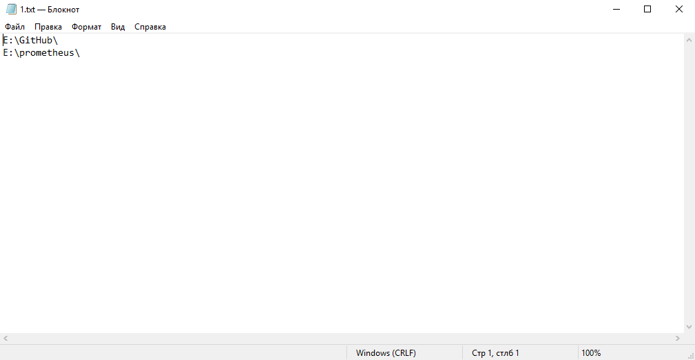
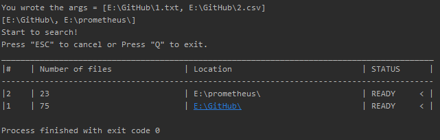
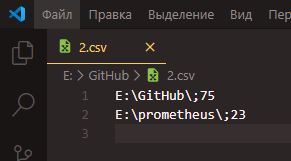
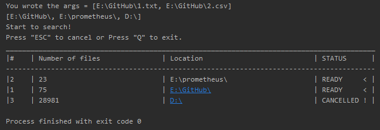

# Counter Files или Счётчик файлов

В `1.txt` список parts:

Через консоль виден результат поиска:

После поиска файлов записывают в `2.csv` результаты поиска.

Вариант отмены поиска с помощью `ESC`
